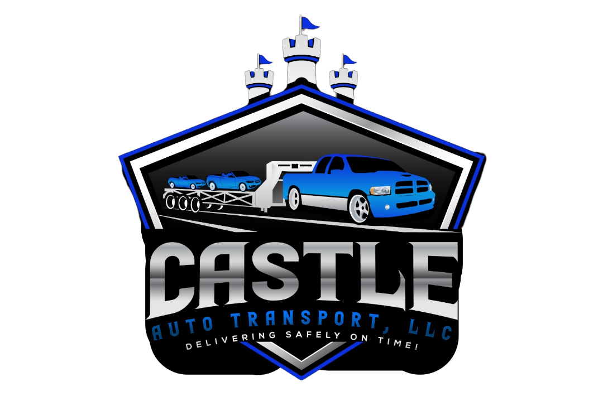

<div align="center">
  <a href="https://github.com/ElAdagioDeJP/Castles_Trailer">
    
  </a>
  <h1>Castle’s Trailer Repair Services</h1>
  <p>Aplicación web para mostrar servicios de reparación de trailers en Leesburg, VA.</p>
  
  <p>
    <a href="https://github.com/ElAdagioDeJP/Castles_Trailer/blob/main/LICENSE">
      
    </a>
    
    
    
    
  </p>
</div>

---

## 📜 Tabla de Contenidos

- [📜 Tabla de Contenidos](#-tabla-de-contenidos)
- [🚀 Descripción](#-descripción)
- [✨ Características](#-características)
- [🛠️ Stack Tecnológico](#️-stack-tecnológico)
- [⚙️ Instalación](#️-instalación)
  - [Prerrequisitos](#prerrequisitos)
  - [Pasos](#pasos)
- [▶️ Ejecución](#️-ejecución)
- [📂 Estructura del Proyecto](#-estructura-del-proyecto)
- [🤝 Contribuir](#-contribuir)
- [📜 Licencia](#-licencia)

## 🚀 Descripción

**Castle’s Trailer Repair Services** es una Single Page Application (SPA) moderna construida con el ecosistema de Next.js 13. La aplicación presenta los servicios de la empresa, facilita el contacto y ofrece una experiencia de usuario fluida y responsiva.

## ✨ Características

- ✅ **Navegación Optimizada:** Menú de navegación *sticky* con un menú desplegable para servicios y adaptado para móviles.
- ✅ **Secciones Interactivas:** Componentes dinámicos para Héroe, Servicios, Sobre Nosotros y Contacto.
- ✅ **Formulario de Contacto:** Formulario controlado con React para una fácil gestión de solicitudes.
- ✅ **Mapa Integrado:** Ubicación de la empresa mostrada a través de Google Maps.
- ✅ **Diseño Moderno:** Interfaz limpia y atractiva implementada con Tailwind CSS y componentes de Radix UI.
- ✅ **Soporte Multi-idioma:** Diseño preparado para internacionalización (🇺🇸🇪🇸).

## 🛠️ Stack Tecnológico

- **Framework:** Next.js 13 (App Router)
- **Lenguaje:** TypeScript
- **UI:** React 18
- **Estilos:** Tailwind CSS
- **Componentes:** Radix UI (`@radix-ui/react-*`)
- **Iconos:** Lucide Icons
- **Gestor de Paquetes:** pnpm

## ⚙️ Instalación

Sigue estos pasos para configurar el entorno de desarrollo local.

### Prerrequisitos

- Node.js v16 o superior
- pnpm

### Pasos

1.  **Clona el repositorio:**
    ```sh
    git clone https://github.com/ElAdagioDeJP/Castles_Trailer.git
    ```

2.  **Navega al directorio del proyecto:**
    ```sh
    cd Castles_Trailer
    ```

3.  **Instala las dependencias:**
    ```sh
    pnpm install
    ```

## ▶️ Ejecución

Una vez instalado, puedes ejecutar la aplicación en diferentes modos:

- **Modo de desarrollo:**
  ```sh
  pnpm dev
  ```
  La aplicación se iniciará en `http://localhost:3000`.

- **Build de producción:**
  ```sh
  pnpm build
  ```

- **Servidor de producción:**
  ```sh
  pnpm start
  ```

## 📂 Estructura del Proyecto

El proyecto está organizado siguiendo las convenciones de Next.js 13:

```
├── app/
│   ├── layout.tsx       # Layout raíz
│   ├── page.tsx         # Página de inicio
│   ├── ClientPage.tsx   # Componente principal de la landing
│   └── globals.css      # Estilos globales
├── components/
│   └── ui/              # Componentes de UI (botones, tarjetas, etc.)
├── hooks/               # Hooks personalizados
├── public/              # Activos estáticos (imágenes, logos)
├── next.config.mjs      # Configuración de Next.js
└── tailwind.config.ts   # Configuración de Tailwind CSS
```

## 🤝 Contribuir

¡Las contribuciones son bienvenidas! Si deseas mejorar este proyecto, sigue estos pasos:

1.  Haz un **Fork** de este repositorio.
2.  Crea una nueva rama para tu feature: `git checkout -b feature/nombre-feature`.
3.  Realiza tus cambios y haz commit: `git commit -m "feat: descripción de cambios"`.
4.  Haz push a tu rama: `git push origin feature/nombre-feature`.
5.  Abre un **Pull Request**.

## 📜 Licencia

Este proyecto está licenciado bajo la **GNU Affero General Public License v3**. Consulta el archivo [LICENSE](LICENSE) para más detalles.